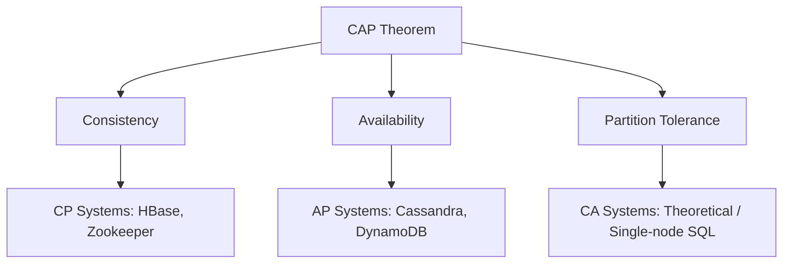

# CAP Theorem for Architecture Interviews

This guide explains the **CAP Theorem**, one of the most important concepts in distributed systems.  
It covers definitions, trade-offs, real-world databases, when to use what, and interview-ready examples.

---

## 1. What is the CAP Theorem?

The **CAP Theorem** states that in a distributed system, you can only guarantee **two out of three** properties at the same time:

1. **Consistency (C)** → Every read gets the most recent write (all nodes see the same data).  
2. **Availability (A)** → Every request receives a response, even if some nodes are down.  
3. **Partition Tolerance (P)** → The system continues working even if network communication between nodes is lost.  

---

## 2. Why CAP Matters

- Distributed systems span networks → **partitions are inevitable**.  
- Designers must choose trade-offs between **Consistency** and **Availability**.  
- No system can have all three simultaneously once a partition occurs.  

---

## 3. CAP in Action

### Consistency
- Every user sees the same data at the same time.  
- Example: In banking, when you transfer money, your balance must update immediately everywhere.  

### Availability
- The system always responds to requests, even if some data may be stale.  
- Example: Social media feed → you’d rather see older posts than get an error.  

### Partition Tolerance
- The system keeps running despite broken communication between nodes.  
- Example: If one data center goes offline, the system continues serving requests from another region.  

---

## 4. Trade-offs

| System Type  | Guarantees           | Trade-off                        | Example Databases |
|--------------|----------------------|----------------------------------|-------------------|
| **CP**       | Consistency + Partition Tolerance | Sacrifices Availability | HBase, MongoDB (CP mode), Zookeeper |
| **AP**       | Availability + Partition Tolerance | Sacrifices Consistency  | Cassandra, DynamoDB, CouchDB |
| **CA** (theoretical only) | Consistency + Availability | Sacrifices Partition Tolerance (not practical at scale) | Single-node SQL systems |

---

## 5. CAP with Real-World Databases

- **SQL databases (Postgres, MySQL)** → CP  
  - Prioritize correctness of data, may sacrifice availability under partition.  

- **NoSQL databases (Cassandra, DynamoDB)** → AP  
  - Always available, but reads may be eventually consistent.  

- **MongoDB** → Configurable (can behave as CP or AP depending on settings).  

---

## 6. Example Scenarios

- **Banking System (CP preferred)**  
  - Losing money or double-spending is unacceptable.  
  - If a partition happens, system may reject requests until nodes sync.  

- **E-commerce Product Catalog (AP preferred)**  
  - Showing slightly outdated stock levels is acceptable.  
  - Better to serve some data than show an error page.  

- **Social Media Feed (AP preferred)**  
  - Eventual consistency is fine → likes, comments may appear a few seconds late.  

---

## 7. When to Use What

### Use **CP Systems** when:
- Data integrity is critical.  
- Even small inconsistencies can cause serious problems.  
- Examples:  
  - Banking and payments.  
  - Inventory management.  
  - Healthcare records.  

### Use **AP Systems** when:
- Availability is more important than strict consistency.  
- Users can tolerate slightly stale data.  
- Examples:  
  - Social media feeds.  
  - Product catalogs.  
  - Real-time analytics dashboards.  

### Use **CA Systems** when:
- Only in **single-node or small-scale environments** where partition tolerance is not an issue.  
- Examples:  
  - Local file systems.  
  - Standalone relational databases (not clustered).  

---

## 8. Visual Representation

## 9. Key Takeaways

- You cannot have **Consistency, Availability, and Partition Tolerance** all at once in a distributed system.  
- **Partitions are inevitable**, so the real choice is **Consistency vs Availability**.  
- **CP systems** → prioritize correctness (banking, inventory, healthcare).  
- **AP systems** → prioritize uptime (social media, ecommerce, analytics).  
- **CA systems** → rare, only in non-distributed setups.  
- Many modern databases offer **tunable consistency**, letting developers choose consistency level per operation.  
