# LeetCode Platform System Design Question


> **Let's Design a Platform Like Leetcode**

## Whats the Problem?

Design a scalable coding platform similar to LeetCode that allows users to:
- Browse and solve coding problems
- Submit solutions in multiple programming languages
- Get real-time feedback on code execution
- View leaderboards and track progress
- Discuss solutions with the community

**Scale**: Support 10M+ users, 1M+ daily active users, handling 10K+ code submissions per minute.

## Functional Requirements we are aiming for

### In Scope
- **Problem Management**: Browse, search, and filter coding problems by difficulty, topic, company
- **Code Submission**: Submit solutions in multiple languages (Python, Java, C++, JavaScript)
- **Real-time Execution**: Run code against test cases with time/memory limits
- **User Progress**: Track solved problems, submission history, and performance metrics
- **Leaderboards**: Global and contest-specific rankings
- **Discussion Forums**: Problem-specific discussion threads
- **Contest System**: Timed coding competitions

### Out of Scope for this question
- Video tutorials or educational content
- Premium subscription billing
- Mobile app development
- Advanced IDE features (debugging, autocomplete)

## Non Functional Requirements we are aiming for

| Requirement | Target | Notes |
|-------------|--------|-------|
| **Availability** | 99.9% | Availability > Consistency for better UX |
| **Latency** | <200ms API, <5s code execution | Fast feedback loops crucial |
| **Throughput** | 10K submissions/min peak | Handle contest traffic spikes |
| **Consistency** | Eventually consistent | Leaderboards can have slight delays |
| **Security** | Sandbox isolation | Prevent malicious code execution |
| **Scalability** | 10x growth capacity | Auto-scaling architecture |

## Core Entities


## API Endpoints

### Problem Management
```http
GET    /api/v1/problems                    # List problems with filters
GET    /api/v1/problems/{problemId}        # Get problem details
GET    /api/v1/problems/{problemId}/stats  # Get problem statistics
```

### Code Submission & Execution
```http
POST   /api/v1/submissions                 # Submit code solution
GET    /api/v1/submissions/{submissionId}  # Get submission status
GET    /api/v1/users/{userId}/submissions  # Get user's submissions
POST   /api/v1/submissions/{submissionId}/test  # Test with custom input
```

### User & Progress
```http
GET    /api/v1/users/{userId}/profile      # Get user profile
GET    /api/v1/users/{userId}/progress     # Get solving progress
PUT    /api/v1/users/{userId}/profile      # Update profile
```

### Leaderboards & Rankings
```http
GET    /api/v1/leaderboard/global          # Global user rankings
GET    /api/v1/leaderboard/contests/{id}   # Contest-specific rankings
GET    /api/v1/contests/{id}/standings     # Live contest standings
```

### Discussion Forum
```http
GET    /api/v1/problems/{problemId}/discussions  # Get problem discussions
POST   /api/v1/discussions                       # Create new discussion
POST   /api/v1/discussions/{id}/vote             # Upvote/downvote
```

## System Walkthrough

### User Flow: Browse → Solve → Submit → Results


### High Level Architecture

```mermaid
graph TB
    subgraph "Client Layer"
        WEB[Web App]
        MOBILE[Mobile App]
    end
    
    subgraph "Load Balancing"
        LB[⚖️ Load Balancer<br/>nginx/ALB]
    end
    
    subgraph "API Layer"
        API1[API Server 1]
        API2[API Server 2]
        API3[API Server 3]
    end
    
    subgraph "⚡ Processing Layer"
        QUEUE[Message Queue<br/>RabbitMQ/SQS]
        EXECUTOR[Code Execution<br/>Service]
    end
    
    subgraph "Execution Environment"
        DOCKER1[Docker Container]
        DOCKER2[Docker Container]
        DOCKER3[Docker Container]
    end
    
    subgraph "Data Layer"
        POSTGRES[(PostgreSQL<br/>Problems, Users)]
        SUBMISSIONS[(PostgreSQL<br/>Submissions)]
        REDIS[Redis<br/>Cache & Sessions]
        S3[S3<br/>Test Cases, Assets]
    end
    
    WEB --> LB
    MOBILE --> LB
    LB --> API1
    LB --> API2
    LB --> API3
    
    API1 --> QUEUE
    API2 --> QUEUE
    API3 --> QUEUE
    
    QUEUE --> EXECUTOR
    EXECUTOR --> DOCKER1
    EXECUTOR --> DOCKER2
    EXECUTOR --> DOCKER3
    
    API1 --> POSTGRES
    API1 --> SUBMISSIONS
    API1 --> REDIS
    API1 --> S3
    
    EXECUTOR --> SUBMISSIONS
    EXECUTOR --> REDIS
    
    style DOCKER1 fill:#ff6b6b,stroke:#ffffff,stroke-width:2px,color:#ffffff
    style DOCKER2 fill:#ff6b6b,stroke:#ffffff,stroke-width:2px,color:#ffffff
    style DOCKER3 fill:#ff6b6b,stroke:#ffffff,stroke-width:2px,color:#ffffff
    style REDIS fill:#00d4aa,stroke:#ffffff,stroke-width:2px,color:#ffffff
```



### Async Submission Processing


### Redis Leaderboard Caching


## Security & Isolation

### Code Execution Sandbox
- **Docker Containers**: Each submission runs in isolated containers
- **Resource Limits**: CPU (1 core, 2s timeout), Memory (128MB), Disk (10MB)
- **Network Isolation**: No internet access from execution environment
- **User Restrictions**: Non-root user, restricted system calls
- **File System**: Read-only base image, temporary writable layer

### API Security
- **Authentication**: JWT tokens with refresh mechanism
- **Rate Limiting**: 100 requests/minute per user, 10 submissions/minute
- **Input Validation**: Sanitize all user inputs, code length limits
- **SQL Injection**: Parameterized queries, ORM usage
- **CORS**: Restricted origins for web clients

## Scaling Considerations

### Database Scaling


### Horizontal Scaling Strategies
1. **API Servers**: Stateless, auto-scaling based on CPU/memory
2. **Code Executors**: Kubernetes pods, scale based on queue length
3. **Database**: Read replicas, connection pooling, query optimization
4. **Caching**: Redis cluster, consistent hashing for distribution
5. **Storage**: S3 for test cases, CDN for static assets

### Performance Optimizations
- **Database Indexing**: Composite indexes on (user_id, problem_id), (difficulty, topics)
- **Query Optimization**: Pagination, selective field loading
- **Caching Strategy**: L1 (Application), L2 (Redis), L3 (CDN)
- **Connection Pooling**: Database and Redis connection pools
- **Async Processing**: Non-blocking I/O for submission handling

## 🔍 How can we go deeper (Breadth vs Depth)

### 1. Contest System Architecture
**Challenge**: Handle 100K+ concurrent users during contests
- Real-time leaderboards with WebSocket updates
- Contest problem release scheduling
- Anti-cheating mechanisms (code similarity detection)
- Penalty calculation algorithms

### 2. Code Execution Security
**Challenge**: Prevent malicious code from breaking the system
- Advanced sandboxing with seccomp filters
- Resource monitoring and automatic termination
- Language-specific security considerations
- Vulnerability scanning for user code

### 3. Global Scale Distribution
**Challenge**: Serve users worldwide with low latency
- Multi-region deployment strategy
- Data replication across regions
- CDN optimization for problem assets
- Geographic load balancing

### 4. Advanced Caching Strategies
**Challenge**: Optimize for different access patterns
- Multi-level caching hierarchy
- Cache invalidation strategies
- Distributed cache consistency
- Cache warming techniques

### 5. Analytics & Monitoring
**Challenge**: Track system performance and user behavior
- Real-time metrics dashboard
- A/B testing framework
- User journey analytics
- Performance bottleneck identification


<div align="center">

</div>
