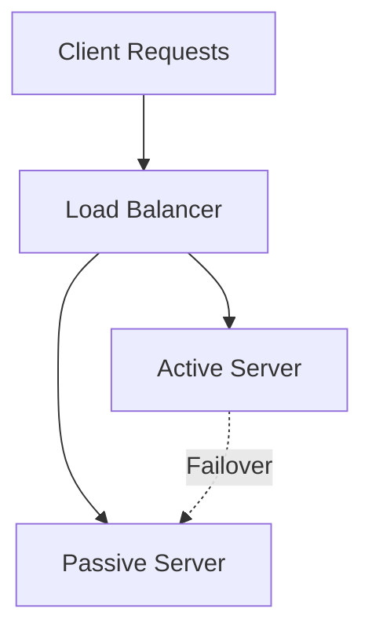

# Fault Tolerance & Redundancy for Architecture Interviews

This guide explains **fault tolerance** and **redundancy**, two key pillars of reliable distributed system design.  
It covers techniques, design patterns, trade-offs, and real-world examples.

---

## 1. Fault Tolerance

### Definition
Fault tolerance is the ability of a system to continue operating correctly even when part of the system fails.  

- Failures can happen due to:  
  - Hardware crashes (disk, memory, CPU).  
  - Network outages.  
  - Software bugs.  
  - Data center failures.  

### Why It Matters
- Ensures **high availability (HA)**.  
- Improves **user trust** — users don’t see downtime.  
- Critical in systems like **payments, healthcare, aviation, and cloud platforms**.  

### Techniques for Fault Tolerance
1. **Replication**  
   - Keep multiple copies of data or services.  
   - Example: multiple database replicas.  

2. **Failover**  
   - Automatic switch to backup when a primary component fails.  
   - Example: secondary server takes over if primary crashes.  

3. **Graceful Degradation**  
   - System continues to provide partial service.  
   - Example: if recommendations fail, ecommerce site still allows checkout.  

4. **Retries with Backoff**  
   - Clients retry requests after failure, waiting progressively longer between attempts.  

5. **Circuit Breakers**  
   - Prevent cascading failures by cutting off failing services temporarily.  

---

## 2. Redundancy

### Definition
Redundancy is the duplication of **critical components or functions** of a system to increase reliability.  

- “Don’t put all your eggs in one basket.”  

### Types of Redundancy
1. **Hardware Redundancy**  
   - Multiple servers, network paths, or storage devices.  
   - Example: RAID disk arrays (mirror, parity).  

2. **Data Redundancy**  
   - Multiple copies of data across regions or clusters.  
   - Example: S3 stores data across **3+ availability zones**.  

3. **Network Redundancy**  
   - Multiple ISPs or network routes.  
   - Ensures connectivity even if one path fails.  

4. **Geographic Redundancy**  
   - Data replicated across regions.  
   - Example: multi-region deployments in AWS, GCP, Azure.  

---

## 3. Fault Tolerance vs Redundancy

- **Redundancy** = having backups (extra components).  
- **Fault tolerance** = ability to **use those backups automatically** when failures occur.  

| Concept         | Focus                     | Example                     |
|-----------------|---------------------------|-----------------------------|
| Redundancy      | Duplication of resources  | Multiple database replicas  |
| Fault Tolerance | Surviving failures        | Automatic failover to replica |

---

## 4. Design Patterns for Reliability

- **Active-Passive Failover** → one node active, one standby.  
- **Active-Active Failover** → all nodes active, traffic shared.  
- **Quorum-based Systems** → majority agreement required (used in consensus protocols like Raft, Paxos).  
- **Checkpointing** → periodically save state to recover after crash.  
- **Idempotency** → design APIs so retries don’t cause double effects.  

## 5. Trade-offs

- **Cost vs Reliability**  
  Redundancy adds expense (extra servers, storage, networking).  

- **Complexity vs Simplicity**  
  Fault-tolerant systems are harder to build and maintain compared to simple architectures.  

- **Consistency vs Availability**  
  Sometimes redundancy creates conflicts (see CAP theorem). Systems must choose which to prioritize.  

---

## 6. Real-World Examples

### Netflix
- **Chaos Engineering (Chaos Monkey)** tests fault tolerance by randomly shutting down servers.  
- Geographic redundancy across AWS regions.  
- Active-active microservices with load balancing.  

### Google Cloud Storage
- Redundant storage across availability zones.  
- Automatic failover ensures durability and availability.  

### Amazon
- **S3** provides *11 nines* (99.999999999%) durability using redundancy.  
- **Route 53** provides DNS-level failover.  

---

## 7. Recap

- **Fault Tolerance** → ability to keep working when things fail.  
- **Redundancy** → duplication of critical resources for reliability.  
- Together they ensure **high availability, resilience, and durability**.  
- Real-world systems combine replication, failover, and redundancy with smart design patterns.  

---
