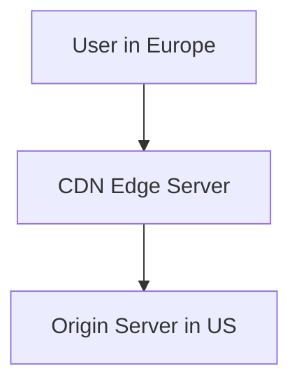

# Networking Systems for Architecture Interviews

This guide covers networking fundamentals for system/architecture interviews.  
It explains IP addressing, DNS, HTTP/HTTPS, TCP vs UDP, CDNs, proxies, firewalls, and real-world examples.

---

## 1. Basics of Networking

Networking is about how computers communicate with each other.  
Core components include:  
- **IP Addresses** → Unique identifier for each device on a network.  
- **Ports** → Logical endpoints (e.g., HTTP uses port 80, HTTPS uses port 443).  
- **Protocols** → Rules that define how data is exchanged (TCP, UDP, HTTP).  

---

## 2. TCP vs UDP

### TCP (Transmission Control Protocol)
- Connection-oriented (handshake before communication).  
- Reliable → guarantees delivery and order.  
- Slower due to overhead (retries, acknowledgments).  
- Used for: web browsing (HTTP/HTTPS), email (SMTP), file transfer (FTP).  

### UDP (User Datagram Protocol)
- Connectionless, "fire and forget".  
- Faster, lightweight.  
- No guarantee of delivery or order.  
- Used for: video streaming, gaming, VoIP, DNS queries.  

| Feature        | TCP (Reliable)       | UDP (Fast)              |
|----------------|----------------------|--------------------------|
| Reliability    | Guaranteed           | Not guaranteed           |
| Speed          | Slower               | Faster                   |
| Use Cases      | Web, email, banking  | Video calls, gaming, DNS |

---

## 3. DNS (Domain Name System)

**Definition**: DNS translates human-readable names (like `www.google.com`) into IP addresses.  

### DNS Resolution Steps
1. User enters `example.com`.  
2. Browser checks local cache.  
3. Query goes to **recursive resolver** (ISP).  
4. Resolver asks **root DNS server** → directs to TLD server (.com).  
5. TLD server points to **authoritative DNS server** for example.com.  
6. Authoritative server returns the IP.  
7. Browser connects to that IP.  

**Types of DNS Records**  
- **A record** → maps domain to IPv4 address.  
- **AAAA record** → maps domain to IPv6 address.  
- **CNAME** → alias for another domain.  
- **MX** → mail server for email routing.  

---

## 4. HTTP vs HTTPS

### HTTP
- HyperText Transfer Protocol.  
- Cleartext → data is not encrypted.  

### HTTPS
- HTTP + SSL/TLS encryption.  
- Ensures confidentiality, integrity, and authenticity.  
- Uses certificates issued by trusted Certificate Authorities (CAs).  

**When to use HTTPS**  
- Always → modern systems must encrypt traffic.  
- Especially critical for sensitive data (payments, login, personal info).  

---

## 5. CDNs (Content Delivery Networks)

**Definition**: A CDN caches and serves content (images, videos, scripts) from servers geographically closer to users.  

### Benefits
- Reduces latency.  
- Decreases load on origin server.  
- Improves availability (DDoS protection, failover).  

**Examples**: Cloudflare, Akamai, AWS CloudFront.  

## 6. Proxies and Firewalls

### Proxies
A proxy acts as an intermediary between a client and a server.  

- **Forward Proxy**  
  - Sits between a client and the internet.  
  - Hides client identity.  
  - Common use: anonymizing user traffic.  

- **Reverse Proxy**  
  - Sits in front of servers and routes client requests to them.  
  - Examples: **Nginx, HAProxy**.  
  - Common use: load balancing, SSL termination, caching.  

**Benefits of Proxies**  
- Caching for faster responses.  
- Load balancing.  
- Security (hiding internal network details).  
- Anonymity for clients.  

---

### Firewalls
Firewalls control incoming and outgoing network traffic based on rules.  

- **Network Firewalls** → filter packets at the IP/port level.  
- **Application Firewalls (WAF)** → filter traffic at the application layer (e.g., block SQL injection or XSS).  

**Benefits of Firewalls**  
- Protect against malicious traffic.  
- Prevent unauthorized access.  
- Enforce security policies.  

---

## 7. Networking in Distributed Systems

Networking is critical for scaling distributed systems.  

- **Load Balancers** → distribute traffic across multiple servers for performance and fault tolerance.  
- **Service Discovery** → automatically detect services (e.g., **Consul, etcd, Kubernetes DNS**).  
- **API Gateways** → single entry point for microservices, manage authentication, rate limiting, and routing (e.g., **Kong, Envoy, Nginx**).  
- **Message Queues** → enable asynchronous communication between services (e.g., **Kafka, RabbitMQ, SQS**).  

---

## 8. Real-World Examples

### Netflix
- Uses **CDN (Open Connect)** for global video delivery.  
- Load balancers distribute traffic across servers.  
- TLS everywhere to ensure encrypted communication.  

### WhatsApp
- **UDP** for fast message delivery.  
- **TCP** as fallback for reliability.  
- End-to-end encryption with TLS + **Signal Protocol**.  

### Uber
- **DNS load balancing** routes traffic to the nearest data center.  
- APIs are placed behind gateways for security and throttling.  
- Uses **Kafka** for real-time event streaming (ride requests, driver updates).  

---

## 9. Recap

- Networking connects systems using **IPs, ports, and protocols**.  
- **TCP** = reliable, **UDP** = fast but less reliable.  
- **DNS** maps domains to IP addresses.  
- **HTTPS** encrypts traffic and ensures secure communication.  
- **CDNs** reduce latency and improve availability.  
- **Proxies** and **firewalls** secure and optimize traffic.  
- Distributed systems rely on **load balancing, service discovery, API gateways, and message queues**.  

---

