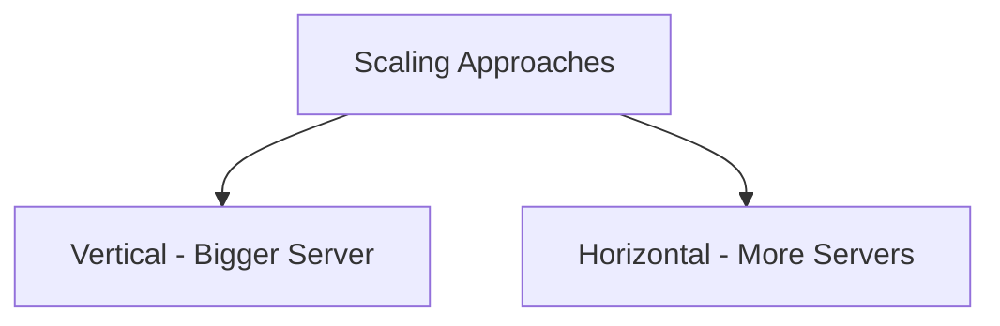
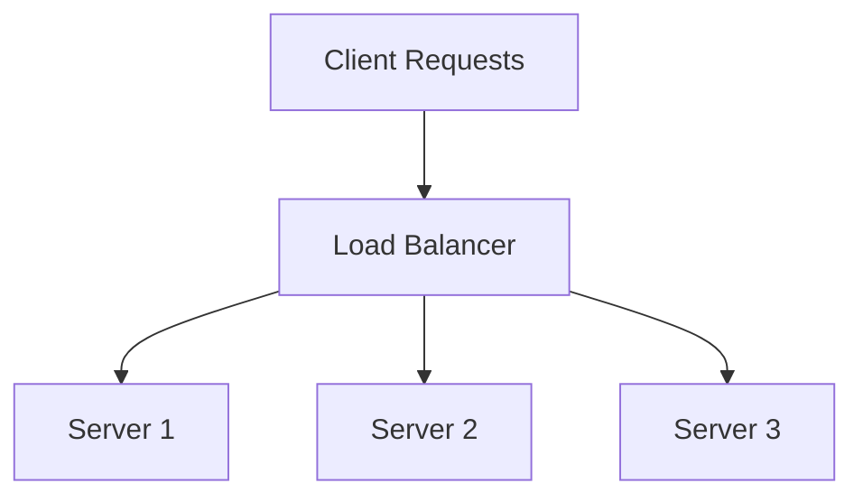
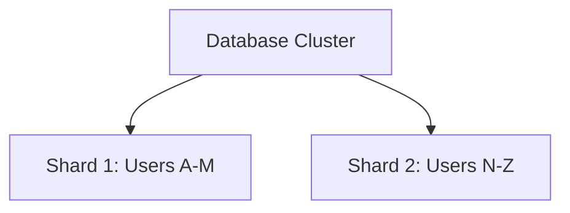

# Scalability Systems for Architecture Interviews

This guide covers scalability fundamentals for system/architecture interviews.  
It explains vertical vs horizontal scaling, load balancing, replication, sharding, CAP theorem, and real-world examples.

---

## 1. What is Scalability?

Scalability is the ability of a system to handle increased load by adding resources.  
- If users double, can the system still serve them reliably?  
- Two main approaches: vertical scaling and horizontal scaling.  

---

## 2. Vertical vs Horizontal Scaling

### Vertical Scaling (Scale Up)
- Add more resources (CPU, RAM, disk) to a single server.  
- Simple to implement, no code changes needed.  

**Strengths**  
- Easy to start with.  
- Works well for small to medium workloads.  

**Weaknesses**  
- Hardware limits (cannot scale indefinitely).  
- Single point of failure.  
- Expensive at large scale.  

---

### Horizontal Scaling (Scale Out)
- Add more servers/nodes to distribute load.  
- Requires distributed systems design.  

**Strengths**  
- Theoretically unlimited scalability.  
- Better fault tolerance (if one node fails, others serve).  
- Cost-efficient with commodity hardware.  

**Weaknesses**  
- Complex: requires replication, sharding, consensus.  
- Harder debugging and monitoring.  

## 3. Load Balancing

**Definition**:  
Load balancing distributes incoming traffic across multiple servers to ensure that no single server becomes a bottleneck or point of failure.  

Without load balancing, if all requests go to one server:  
- That server can crash under heavy traffic.  
- System performance becomes unpredictable.  
- Single point of failure brings down the whole service.  

---

### Types of Load Balancing

1. **DNS-based Load Balancing**  
   - DNS servers rotate IP addresses returned to clients (round-robin DNS).  
   - Simple but **not dynamic** (DNS caching delays prevent quick failover).  
   - Good for coarse traffic distribution (e.g., across regions).  

2. **Hardware Load Balancers**  
   - Physical appliances placed in data centers.  
   - Provide high throughput and reliability.  
   - Expensive and less flexible.  

3. **Software Load Balancers**  
   - Run on commodity hardware.  
   - Examples: **Nginx, HAProxy, Envoy**.  
   - Flexible, cost-effective, and widely used in modern systems.  

4. **Cloud Load Balancers**  
   - Managed services provided by cloud providers.  
   - Examples: **AWS Elastic Load Balancer, GCP Cloud Load Balancer, Azure LB**.  
   - Automatically scale and integrate with cloud services.  

---

### Strategies for Load Distribution

- **Round Robin** → Requests distributed evenly across servers.  
- **Least Connections** → New requests sent to the server with the fewest active connections.  
- **IP Hash** → Requests from the same client IP always go to the same server (good for sticky sessions).  
- **Weighted Distribution** → Servers with more capacity (CPU, RAM) get more requests.  

---

### When to Use What
- **Round Robin** → Simple, when servers are roughly equal in capacity.  
- **Least Connections** → When some requests are heavier (like video streaming).  
- **IP Hash** → When session stickiness is required (shopping carts, user state).  
- **Weighted** → When you have heterogeneous servers (different capacity levels).  

## 4. Replication and Sharding

### Replication
Replication means copying data across multiple nodes to improve performance and reliability.

- **Master-Slave (Primary-Replica)**  
  - Writes go to the master, reads can go to replicas.  
  - Improves read scalability and availability.  
  - **Risk**: master is a single point of failure unless failover is configured.  

- **Master-Master (Multi-Primary)**  
  - Multiple writable nodes.  
  - Higher availability and flexibility, but requires conflict resolution.  
  - Useful in systems where writes can occur in different regions.  

---

### Sharding
Sharding means splitting a database into smaller pieces (shards), each holding part of the data.

- **Horizontal partitioning**: rows are distributed across multiple shards.  
- Example: Users A–M stored on Shard 1, Users N–Z stored on Shard 2.  
- Improves write scalability and storage capacity.  
- **Downside**: queries that span multiple shards are harder to manage.  

## 5. Caching

### Definition
Caching stores frequently accessed data in **fast storage (memory)** so it can be retrieved more quickly.

---

### Benefits
- Reduces database load.  
- Improves response times (latency).  
- Helps absorb sudden traffic spikes.  

---

### Caching Layers
1. **Client-side caching** → Browser stores static assets (HTML, CSS, JS).  
2. **CDN caching** → Content Delivery Networks cache images, videos, and static files closer to users.  
3. **Server-side caching** → Databases cache queries or results (e.g., Redis, Memcached).  
4. **Application-level caching** → Apps cache computed results to reduce repeated work.  

---

### When to Use
- If reads are significantly higher than writes (e.g., news feeds, product pages).  
- If data can tolerate slight staleness (eventual consistency).  
- If performance (low latency) is critical.  

---

## 6. CAP Theorem

### Definition
In a distributed system, you cannot guarantee all three of the following at once:

1. **Consistency (C)** → Every read receives the most recent write.  
2. **Availability (A)** → Every request gets a response, even if some nodes are down.  
3. **Partition Tolerance (P)** → The system continues working even if communication between nodes is unreliable.  

---

### Why CAP Matters
- In distributed systems, **network failures are inevitable**.  
- When a partition happens, you must choose between:  
  - **Consistency** → return errors until all nodes are in sync.  
  - **Availability** → serve possibly stale data, but never fail.  

---

### Trade-offs in Practice

| Database Type         | Trade-off Chosen |
|-----------------------|------------------|
| SQL (Postgres, MySQL) | CP → Strong consistency, less availability under partition |
| Cassandra, DynamoDB   | AP → Prioritize availability, eventual consistency |
| MongoDB (configurable)| Can lean towards CP or AP depending on setup |

---

### When to Use
- **Consistency (CP systems)** → Banking, financial transactions, inventory control.  
- **Availability (AP systems)** → Social media feeds, recommendation engines, real-time analytics.  
- **Partition Tolerance** → Always required in distributed systems, because network partitions are inevitable.  

---

## 7. Real-World Examples

### Instagram
- CDN for storing and delivering photos.  
- Sharded databases for user data.  
- Redis cache for feed timelines.  
- Load balancers to distribute user requests.  

### Uber
- Geolocation data sharded by region for scalability.  
- Kafka queues to handle ride-matching asynchronously.  
- Load balancers to handle bursty real-time requests.  

### Netflix
- CDN (Open Connect) for global video delivery.  
- Horizontal scaling with microservices across many regions.  
- Caching layers reduce database hits and speed up content delivery.  

---

## 8. Recap

- Vertical scaling = bigger machine; horizontal scaling = more machines.  
- Load balancers distribute traffic and improve fault tolerance.  
- Replication improves availability and read scalability.  
- Sharding improves write scalability and storage capacity.  
- Caching reduces latency and protects backend databases.  
- CAP theorem explains the trade-offs in distributed system design.  
- Real-world systems use a combination of all these techniques.  

---
